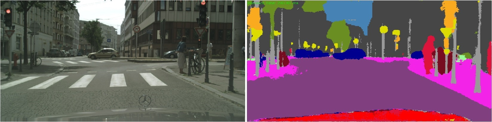
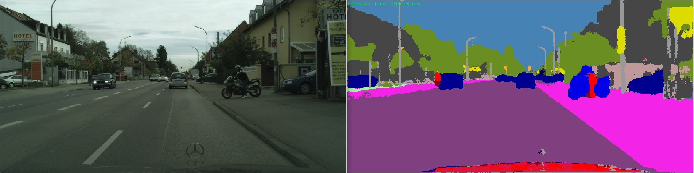

# Caffe-enet

A modified version of Caffe which supports the ENet architecture [github repo website](https://github.com/TimoSaemann/ENet).
It's caffemodel and protxt file cant not applied in OpenCv directly. [download](https://github.com/TimoSaemann/ENet)

Upsamle layer and BN layer has been re-implentmented in opencv, and modefied prototxt file (bn_param)to adapt new layers version. More detail in [model/enet_deploy_final.prototxt](https://github.com/wanggao1990/opencv_dnn_application/blob/master/caffe-app/caffe-enet/model/enet_deploy_final.prototxt) folder.

**Requirement:**
opencv version 4.x

test results:

